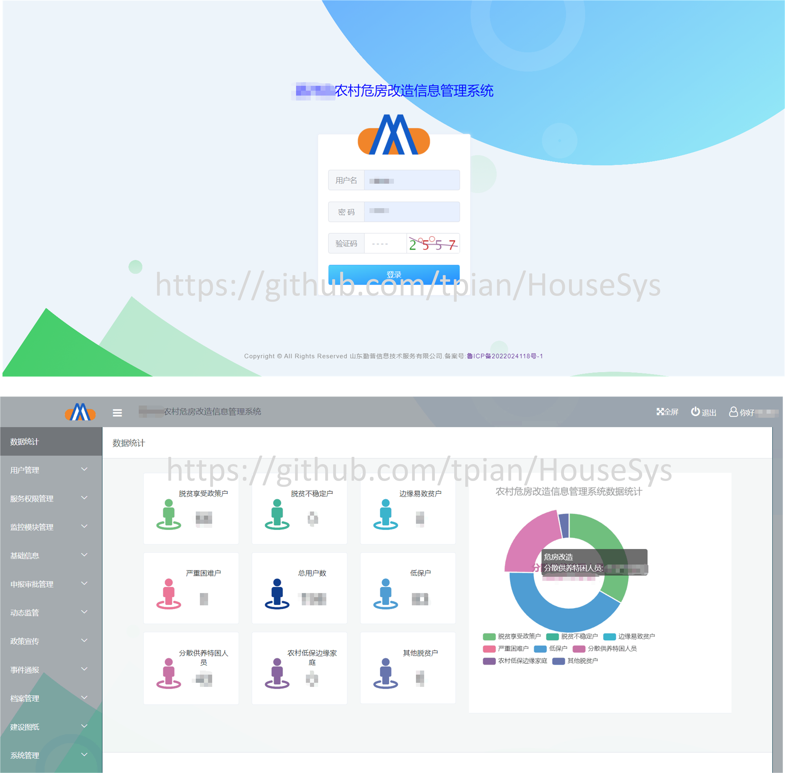
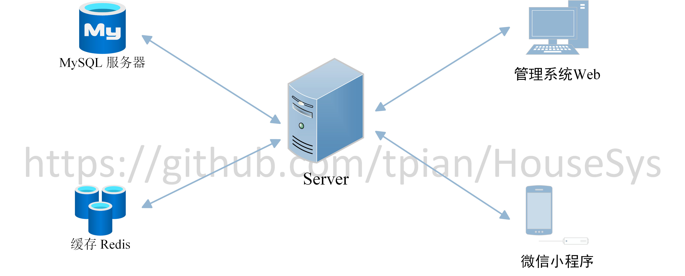
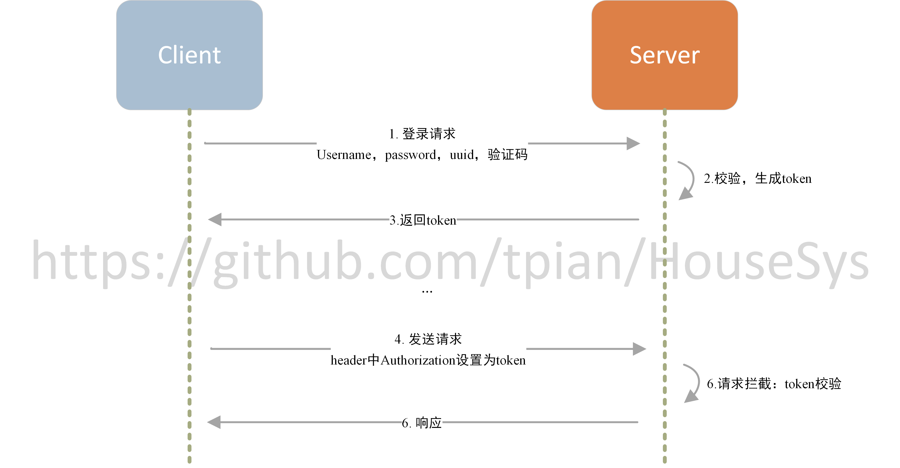
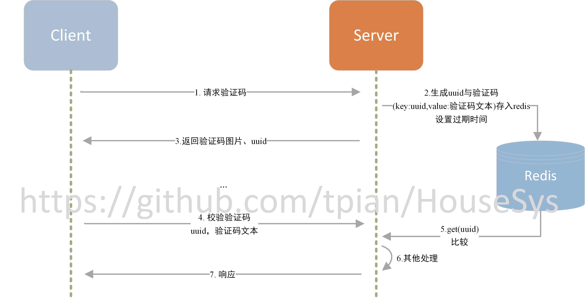
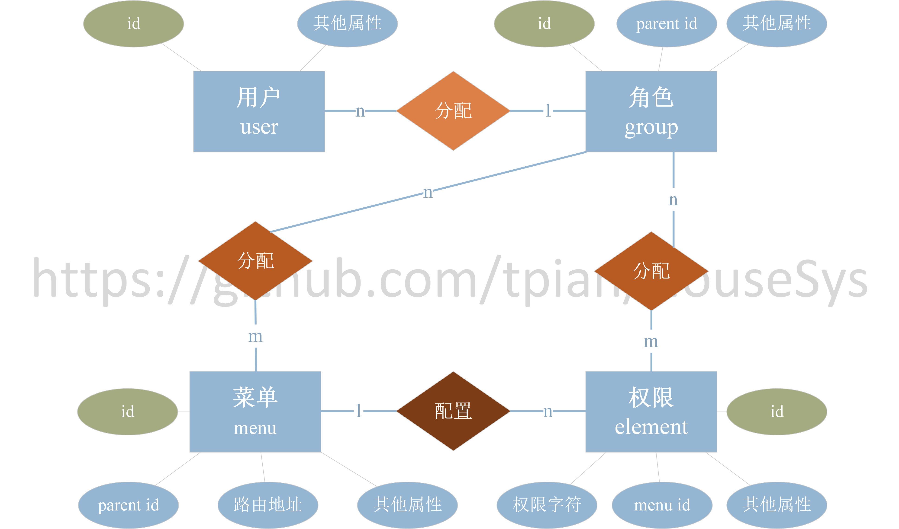
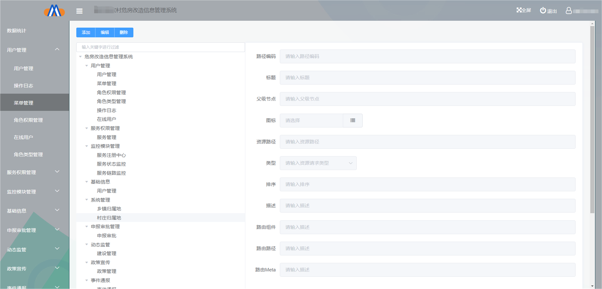

# HouseSys

对个人完成的项目危房改造管理系统的后端介绍说明，项目已商用，本仓库仅做介绍与**后端框架**学习用途，项目代码不开源
线上商用地址：https://weifangguanli.com
Web 管理系统主页截图：

小程序主页截图：


## 系统架构


系统中主要包括 MySQL、Redis、后端服务器、Web 管理系统、微信小程序五个部分。

1. Web 管理系统：

   > **登录用户**：村、镇街、局县、民政局、住建局干部；
   > **主要作用**：
   >
   > - 进行系统用户管理，干部注册；
   > - 完成对农户的危房改造申请进行审核审批的功能；
   > - 发布新政策、违规警告；
   > - 系统数据看板；
   > - 完工的危房改造建设项目生成 word 档案，并在线打印

2. 微信小程序

   > **登录用户**：申请危房改造的农户；村、镇街、局县、民政局、住建局干部；
   > **主要作用**：
   >
   > - 农户登录
   >   - 农户注册；
   >   - 提出危房改造申请；
   >   - 改造申请通过后，建房过程中，提交房屋图片、建房计划、责任书等材料。
   > - 干部登录
   >   - 审核/驳回申请

3. 后端服务器：

   > - 连接数据库，实现数据管理
   > - 与客户端（web、小程序）进行网络通信，提供服务 api

4. MySQL 数据库：

   > - 存储主要的业务数据，如乡镇选项、系统用户、用户权限、申请记录、建设记录等。

5. Redis 缓存：
   > - 缓存验证码、用户权限、token、在线状态等有过期时间数据或热点数据。

## 技术栈

- Java
- Sping Boot: 简化 Spring 应用的创建、运行、调试、部署;
- Spring Cloud: 基于 Spring Boot 的开发便利性，简化了分布式系统基础设施的开发，构建了服务治理(发现注册)、配置中心、消息总线、负载均衡、断路器、数据监控、分布式会话和集群状态管理等功能;
- Mybatis: 内部封装了 JDBC，简化了加载驱动、创建连接、创建 statement 等繁杂的过程，开发者只需要关注 SQL 语句本身;
- Nacos: Spring Cloud 中的注册中心,发现、配置和管理微服务；
- Sentinel： 流量卫兵，发挥数据监控与限流作用。

## 后端环境

```
JDK 1.8
MySQL 5.7.36
Redis
Maven
IDEA编译器，IDE插件，lombok插件
```

## 后端架构

本项目后端主要采用了在 Spring Cloud 微服务架构，能支持多业务系统并行运行。在本项目的中运行的业务系统主要为危房改造业务系统，除此业务外，本系统还能支持其他业务。


### 架构组件

&emsp;&emsp;微服务中包含三个基本组件：注册中心、服务提供者、服务消费者。当服务消费者 A 需要调用服务提供者 B 的接口时，由注册中心向 A 提供 B 的地址与端口进行调用。

&emsp;&emsp;在本系统中，微服务只接受来自网关的请求，而客户端与服务器通信的唯一入口是 gateway，能保障后台服务的安全性，并动态地将请求路由到不同的后端集群中，本系统 center service 是众多后端集群中的一种，如图：


#### 1.Service Consumer（Gateway）

项目中使用的服务消费者同时是本系统的网关 gateway，网关服务的 application.yml 相关配置如下：

```yml
server:
  port: 8765

#请求和响应GZIP压缩支持
feign:
  httpclient:
    enabled: false
  okhttp:
    enabled: true
  compression:
    request:
      enabled: true
      mime-types: text/xml,application/xml,application/json
      min-request-size: 2048
    response:
      enabled: true

spring:
  application:
      name: gateway-name  #自己设置服务名
  redis: # redis配置
      database: 2
      host: xxx.xxx.xxx.xxx # 需要根据实际配置redis IP
      port: xxxx # 需要根据实际配置redis端口号
      password: ******* # 需要根据实际配置redis密码
      jedis:
        pool:
            max-active: 20 # 连接池最大连接数
  rabbitmq: # 消息队列rabbitmq配置
      host: ${RABBIT_MQ_HOST:localhost}
      port:  ${RABBIT_MQ_PORT:5672}
      username: xxxx # 需要根据实际配置rabbitmq用户名
      password: xxxx # 需要根据实际配置rabbitmq密码
  sleuth: # 链路追踪
    enabled: false
    http:
      legacy:
        enabled: true
  cloud:
    nacos:  # 注册中心
      discovery:
        server-addr: xxx.xxx.xxx.xxx:xxxx  # 需要根据实际配置nacos IP与端口号
    gateway:
      default-filters: # 默认过滤器配置(全局过滤器)
         - DedupeResponseHeader=Access-Control-Allow-Origin  # 允许跨域请求
      globalcors: #跨域配置
         add-to-simple-url-handler-mapping: true
         corsConfigurations:
           '[/**]':
             allowed-origins: "xxxxxx" #  运行跨域请求的网站
             allowed-methods: "*"  # 允许跨域的请求方式：所有
             allowed-headers: "*"  # 允许跨域请求携带的头信息头信息：所有
             allow-credentials: true  # 允许携带cookie
      discovery:
        locator:
          lowerCaseServiceId: true  # 请求路径上的服务名配置为小写
          enabled: true  # 通过注册中心创建路由
      routes:  # 自定义转发路径
        - id: ace-auth  # 目标服务ID
          uri: lb://ace-admin  # 在nacos中注册的目标服务URI
          order: 8000  # 路由顺序
          predicates: #断言，与下面条件相匹配的请求进行路由
          - RequestBody=true  #需要请求头
          - Path=/api/auth/**  #路径匹配
          filters:
          - StripPrefix=2  # 改写HTTP请求，转发时去掉前2个前缀
        - id: ace-admin
          uri: lb://ace-admin #注意和上一个服务是同一个URI，本质在同一个URI中
          order: 8001
          predicates:
          - RequestBody=true
          - Path=/api/admin/**
          filters:
          - StripPrefix=2

         # 下面两个URI非本危房管理系统中用到的URI，不做介绍
        - id: ace-generator
          uri: lb://ace-generator
          order: 8001
          predicates:
            - Path=/api/code/**
          filters:
            - StripPrefix=1
        - id: ace-sample
          uri: lb://ace-sample
          order: 8001
          predicates:
            - RequestBody=true
            - Path=/api/sample/**
          filters:
            - StripPrefix=2
    sentinel: # 限流配置
      transport:
        dashboard: xxx.xxx.xxx.xxx:xxxx # 需要根据实际配置sentinel IP与端口号

logging: # 日志配置
  level:
    com.github.wxiaoqi.security.gate.v2: info # 日志级别

management: # 管理端点配置
  endpoints:
    web:
      exposure:
        include: '*'
        exclude: heapdump,dump,threaddump,configprops,env

  security:
    enabled: false


gate: # 网关配置
  ignore:
    startWith: /auth/jwt,/auth/captcha


auth: # 鉴权配置
  serviceId: ace-admin
  user:
    token-header: Authorization
  client:
    id: ace-gate  #不填则默认读取spring.application.name
    secret: 123456


ribbon: # 负载均衡配置
  eureka:
    enabled: true
  ReadTimeout: 60000
  ConnectTimeout: 60000
  MaxAutoRetries: 0
  MaxAutoRetriesNextServer: 1
  OkToRetryOnAllOperations: false

hystrix: # 熔断配置
  threadpool:
    default:
      coreSize: 1000 ##并发执行的最大线程数，默认10
      maxQueueSize: 1000 ##BlockingQueue的最大队列数
      queueSizeRejectionThreshold: 500 ##即使maxQueueSize没有达到，达到queueSizeRejectionThreshold该值后，请求也会被拒绝
  command:
    default:
      execution:
        isolation:
          thread:
            timeoutInMilliseconds: 10000 # 超时时间
```

服务启动类的注解如下：

```Java
@SpringCloudApplication // SpringCloud启动类
@EnableAceAuthClient // 启用鉴权客户端
@EnableFeignClients({"com.github.wxiaoqi.security.auth.client.feign"}) // 启用feign客户端
public class GatewayServerBootstrap {
    public static void main(String[] args) {
        DBLog.getInstance().start();
        SpringApplication.run(GatewayServerBootstrap.class, args);
    }
}
```

gateway 在网络中的主要作用如下：

##### 路由转发

&emsp;&emsp;例如，如通过前面的 routes 配置，发送到网关的请求`/api/auth/captcha`，由于符合转发路径中的第一个路由，请求将转发到将路由到 lb://ace-admin，具体 IP、port 由**注册中心**提供，请求地址也将从`/api/auth/captcha`变成`/captcha`。

##### Feign 功能

&emsp;&emsp;项目中 Feign 功能主要使用在生成公钥的 Auth 服务上，使得 gateway 在使用 HTTP 请求远程 center server 的 Auth 服务时能获得与调用本地方法一样的编码体验，开发者完全感知不到这是远程方法，更感知不到这是个 HTTP 请求，具体实现如下,主要依赖为`spring-cloud-starter-openfeign`。

```xml
<dependency>
   <groupId>org.springframework.cloud</groupId>
   <artifactId>spring-cloud-starter-openfeign</artifactId>
</dependency>
```

该功能的实现方法如下：

&emsp;&emsp;**step 1**: 在启动类上使用注解@EnableFeignClients 启用 feign 客户端；扫描和注册 feign 客户端的 bean 定义，配置见 gateway 的启动类 GatewayServerBootstrap.class 在上方的定义，其中`EnableFeignClients`的值表示当前模块需要用到`com.github.wxiaoqi.security.auth.client.feign`包下的 feign 接口；

&emsp;&emsp;**step 2**: 在`com.github.wxiaoqi.security.auth.client.feign`包下的服务的接口上使用`@FeignClient`注解，使类中的 feign 接口能被发现，并扫描注册,在`@FeignClient`注解中，`value`表示 Auth 服务在 nacos 中定义的所定义的服务名称:

```Java
  @FeignClient(value = "${auth.serviceId}",configuration = {})
  public interface ServiceAuthFeign {
    @RequestMapping(value = "/client/userPubKey",method = RequestMethod.POST)
    public ObjectRestResponse<byte[]> getUserPublicKey(@RequestParam("clientId") String clientId, @RequestParam("secret") String secret);
```

&emsp;&emsp; 而服务的具体的实现定义在 nacos 的`auth.serviceId`服务上。

&emsp;&emsp;**step 3**: 需要调用 Auth 服务的类中使用@Autowired 引用 feign 服务，实现远程调用。

```Java
@Configuration
@Slf4j
public class AuthClientRunner implements CommandLineRunner {
  @Autowired
  private ServiceAuthConfig serviceAuthConfig;
  @Autowired
  private UserAuthConfig userAuthConfig;
  @Autowired
  private ServiceAuthFeign serviceAuthFeign;

  @Override
  public void run(String... args) throws Exception {
      log.info("初始化加载用户pubKey");
      try {
          refreshUserPubKey();
      }catch(Exception e){
          log.error("初始化加载用户pubKey失败,1分钟后自动重试!",e);
      }
  }
  @Scheduled(cron = "0 0/1 * * * ?")
  public void refreshUserPubKey(){
      BaseResponse resp = serviceAuthFeign.getUserPublicKey(serviceAuthConfig.getClientId(), serviceAuthConfig.getClientSecret());
      if (resp.getStatusCode() == HttpStatus.OK.value()) {
          ObjectRestResponse<byte[]> userResponse = (ObjectRestResponse<byte[]>) resp;
          this.userAuthConfig.setPubKeyByte(userResponse.getData());
      }
  }
}
```

##### <span id="incept"> 请求拦截</span>

&emsp;&emsp;在前面的配置中，已通过`default-filters`进行了全局过滤器，此外转发路径`routes`中,通过断言`predicates`、当前路由过滤器`filters`进行对具体某个路由的过滤与转换，已能满足大多数需要。但在危房改造系统中，需要确保通过鉴权的客户端才能与服务器通信，因此实现了 GlobalFilter 接口，对请求进行鉴权拦截。


```Java
@Configuration
public class AccessGatewayFilter implements GlobalFilter {
   @Value("${gate.ignore.startWith}")
   private String startWith; # 通过application.yml配置忽略token校验的接口地址，如获取验证码、获取token接口
   @Autowired
   private StringRedisTemplate stringRedisTemplate; # token保存在redis中，存在过期时间

   // ...其他成员属性

   @Override
   public Mono<Void> filter(ServerWebExchange serverWebExchange, GatewayFilterChain gatewayFilterChain) {
      /**
         通过gatewayFilterChain.filter(exchange)编写前置滤器逻辑，在请求被路由之前调用，设计中仅用到前置过滤器
         通过gatewayFilterChain.filter(exchange).then(Mono.fromRunnable(() -> {过滤器逻辑})编写后置滤器逻辑，在路由到微服务之后调用
         1.校验token是否过期、是否合法，从token获取用户信息校验用户是否具有接口权限
         2.检验用户权限时需要请求微服务中的对应接口
         3.接口地址开头为startWith的接口不需要校验token与权限
      */
   }

   // ...其他成员方法
}
```

&emsp;&emsp;全局过滤器 AccessGatewayFilter 实现了 GlobalFilter 接口，在所有路径上均能进行拦截处理。同时使用了@Configuration 注解使 IOC 容器能扫描注册该全局过滤器。
&emsp;&emsp;在请求拦截中，对 token 的鉴别使用了[ JWT 鉴权](#jwt)，这部分的内容将在 Center Server 的介绍中具体展开。

##### 负载均衡

&emsp;&emsp;当使用微服务集群时，负载均衡会将将流量分发到不同的后端服务来扩展应用系统的服务吞吐能力，消除单点故障并提升应用系统的可用性。在危房改造系统中，通过使用`Spring Cloud Loadbalancer`依赖实现负载均衡，由于 Spring Cloud 默认均衡器为 Ribbon，需要在配置项中将其禁用：

```xml
<dependency>
   <groupId>org.springframework.cloud</groupId>
   <artifactId>spring-cloud-starter-loadbalancer</artifactId>
</dependency>
```

```yml
spring:
  application:
    name: ace-gateway
  cloud:
    loadbalancer:
      ribbon:
      enabled: false
```

&emsp;&emsp;同时，配置`restTemplate`与`WebClient.Builder`对象注入方法，`@LoadBalanced` 注解表示调用远程服务地址时会使用负载均衡器。

```Java
@Configuration
public class GatewayConfig {
    @LoadBalanced
    @Bean
    public RestTemplate restTemplate() {
        return new RestTemplate();
    }

    @Bean
    @LoadBalanced
    public WebClient.Builder loadBalancedWebClientBuilder() {
        return WebClient.builder();
    }
}
```

&emsp;&emsp; 【拓展，可跳过】

&emsp;&emsp;1. 关于 RestTemplate： RestTemplate 是 Spring3.0 开始 提供的用于访问 Rest 服务（相关注解：center server 中`@RestController`）的客户端，提供了多种便捷访问远程 Http 服务的方法，能够大大提高客户端的编写效率。在 Spring Cloud 中，使用 RestTemplate 进行服务间的调用时，会自动实现负载均衡的效果，即会根据服务名来调用不同的服务实例，从而实现负载均衡的效果。

&emsp;&emsp;2. 关于 WebClient.Builder：WebClient.Builder 对象是 Spring WebFlux 中的一个非阻塞式的 HTTP 客户端，与 RestTemplate 不同，WebClient.Builder 对象不会阻塞线程，而是使用异步的方式进行请求，能更好地提升系统的吞吐量。

&emsp;&emsp;3. @LoadBalanced 将请求交给 LoadBalancerInterceptor 来选择微服务节点，默认采用的是轮询策略，每个请求中按时间顺序逐一分配到不同的在微服务集群的节点，如果节点故障或下线则剔除该节点。

```java
@Configuration
 public class GatewayConfig {

    @LoadBalanced
    @Bean
    public RestTemplate restTemplate() {
       return new RestTemplate();
    }
    // ...其他配置
 }
```

##### 服务熔断

&emsp;&emsp;服务器支持的线程和并发数有限，请求一直阻塞，会导致服务器资源耗尽，从而导致所有其它服务都不可用。在危房改造管理系统中，**gateway 与微服务 center server 都使用了 Hystrix 熔断机制**，当请求超时时，会返回错误信息，而不是一直阻塞，从而保证了服务器的可用性。

```yml
hystrix:
  threadpool:
    default:
      coreSize: 1000 ##并发执行的最大线程数，默认10
      maxQueueSize: 1000 ##BlockingQueue的最大队列数
      queueSizeRejectionThreshold: 500 ##即使maxQueueSize没有达到，达到queueSizeRejectionThreshold该值后，请求也会被拒绝
  command:
    default:
      execution:
      isolation:
        thread:
          timeoutInMilliseconds: 10000
```

&emsp;&emsp;Hystrix 会为每个依赖服务调用分配一个小的线程池，如果线程池已满调用将被立即拒绝，默认不采用排队，加速失败判定时间。

&emsp;&emsp;Hystrix 用户的请求将不再直接访问服务，而是通过线程池中的空闲线程来访问服务，如果线程池已满，或者请求超时，将触发**服务降级**：不阻塞线程，而是调用 fallback 方法，返回一个默认值或者缓存的值，而不是抛出异常。

#### 2.Center Server

&emsp;&emsp;项目中使用的服务提供者是本系统的中心服务 center server，application.yml 相关配置如下：

```yml
server:
  port: 8762

logging: # 日志配置
  level:
    com.github.wxiaoqi.security.admin: DEBUG # 日志级别
spring:
  application:
    name: ace-admin
  jackson: # json序列化配置
    date-format: yyyy-MM-dd HH:mm:ss
    time-zone: GMT+8
    default-property-inclusion: non_null
  redis: # redis配置
    database: 2 # redis数据库索引
    host: xxx.xxx.xxx.xxx # 需要根据实际配置redis IP
    port: xxxx # 需要根据实际配置redis端口号
    password: xxxxxxx # 需要根据实际配置redis密码
    jedis:
      pool:
        max-active: 20 # 连接池最大连接数
  servlet: # servlet配置
    multipart:
      # 单个文件大小
      max-file-size: 10MB
      # 设置总上传的文件大小
      max-request-size: 20MB
  datasource: # 数据源配置
    name: test
    url: jdbc:mysql://xxx.xxx.xxx.xxx:xxxx/xxxxxx?useUnicode=true&characterEncoding=UTF8 # 需要根据实际配置mysql IP、端口号、数据库名
    username: xxxx # 需要根据实际配置mysql用户名
    password: xxxxxx # 需要根据实际配置mysql密码
    # 使用druid数据源
    type: com.alibaba.druid.pool.DruidDataSource
    driver-class-name: com.mysql.cj.jdbc.Driver
    filters: stat
    maxActive: 20 # 连接池最大连接数
    initialSize: 1 # 初始化连接数
    maxWait: 60000 # 获取连接最大等待时间
    minIdle: 1 # 最小空闲连接数
    timeBetweenEvictionRunsMillis: 60000 # 间隔多久进行一次检测，检测需要关闭的空闲连接
    minEvictableIdleTimeMillis: 300000 # 空闲连接多久后被关闭
    validationQuery: select 'x' # 用来检测连接是否有效的sql
    testWhileIdle: true # 是否在连接空闲一段时间后检测连接有效性
    testOnBorrow: false # 是否在获取连接时检测连接有效性
    testOnReturn: false # 是否在连接放回时检测连接有效性
    poolPreparedStatements: true # 是否缓存preparedStatement，也就是PSCache
    maxOpenPreparedStatements: 20 # 每个连接上PSCache的大小
  cloud:
    sentinel: # 限流配置
      transport:
        dashboard: xxx.xxx.xxx.xxx:xxxx # 需要根据实际配置sentinel IP与端口号
    nacos: # 注册中心
      discovery:
        server-addr: xxx.xxx.xxx.xxx:xxxx # 需要根据实际配置nacos IP与端口号
mybatis: # mybatis配置
  basepackage: com.github.wxiaoqi.security.admin.modules.mapper # mapper接口所在包
  xmlLocation: classpath:mapper/**/*.xml # mapper.xml文件所在路径
  mapper-locations: 'classpath*:mapper/*.xml' # mapper.xml文件所在路径

# PageHelper分页插件
pagehelper:
  helperDialect: mysql
  supportMethodsArguments: true
  params: count=countSql

# 必须配置
feign:
  httpclient:
    enabled: false
  okhttp:
    enabled: true

ribbon: # 负载均衡配置
  eureka:
    enabled: true
  ReadTimeout: 100000
  ConnectTimeout: 100000
  MaxAutoRetries: 0
  MaxAutoRetriesNextServer: 1
  OkToRetryOnAllOperations: false

hystrix: # 熔断配置
  threadpool:
    default:
      coreSize: 1000 ##并发执行的最大线程数，默认10
      maxQueueSize: 1000 ##BlockingQueue的最大队列数
      queueSizeRejectionThreshold: 500 ##即使maxQueueSize没有达到，达到queueSizeRejectionThreshold该值后，请求也会被拒绝
  command:
    default:
      execution:
        isolation:
          thread:
            timeoutInMilliseconds: 110000 # 超时时间

# 配置swagger
swagger:
  enabled: true
  base-package: com.github.wxiaoqi.security.modules
  title: ace-admin
  version: 1.0.0.SNAPSHOT
  description: 管理后端服务
  contact:
    name: admin

#redis-cache 相关
redis: # redis配置
  pool:
    maxActive: 300 # 连接池最大连接数
    maxIdle: 100 # 连接池最大空闲数
    maxWait: 1000 # 连接池最大阻塞等待时间（使用负值表示没有限制）
  host: ${REDIS_HOST:xxx.xxx.xxx.xxx} # 需要根据实际配置redis IP
  port: ${REDIS_PORT:xxxx} # 需要根据实际配置redis端口号
  password: xxxxxx # 需要根据实际配置redis密码
  timeout: 2000 # 连接超时时间（毫秒）
  # 服务或应用名
  sysName: cloud-admin
  enable: true
  database: 0 # redis数据库索引

management: # 管理端点配置
  endpoints:
    web:
      exposure:
        include: '*'
        exclude: heapdump,dump,threaddump,configprops,env
  security:
    enabled: true

# Jwt认证服务管理
jwt:
  token-header: Authorization
  expire: 14400
  rsa-secret: xxxxxxx # 需要根据实际配置rsa加密密钥

wechat:
  appid: 'xxxxxx' # 需要根据实际配置微信小程序appid
  secret: 'xxxxxx' # 需要根据实际配置微信小程序secret
  temp: 'xxxxxx' # 需要根据实际配置微信小程序模板id
  template: 'xxxxxx' # 需要根据实际配置微信小程序模板id

#阿里云oss服务配置
aliyun:
  oss:
    bucketName: 'xxxxxx' # 需要根据实际配置oss bucketName
    endPoint: 'xxxxxx.com' # 需要根据实际配置oss endPoint
    accessKeyId: 'xxxxxx' # 需要根据实际配置oss accessKeyId
    accessKeySecret: 'xxxxxx' # 需要根据实际配置oss accessKeySecret
    urlPrefix: 'xxxxxx' # 文件上传后的访问地址前缀，需要根据实际配置oss urlPrefix

# 文件路径 示例（Linux配置 /home/dangan/uploadPath）
ace:
  profile: /home/dangan/uploadPath
```

服务启动类的注解如下：

```Java
@EnableDiscoveryClient // 服务发现
@EnableCircuitBreaker // 熔断
@SpringBootApplication // SpringBoot启动类
@EnableTransactionManagement // 开启事务
@MapperScan("com.github.wxiaoqi.security.modules.*.mapper") // mapper接口扫描
@EnableSwagger2Doc  // swagger文档
@EnableAsync // 开启异步
public class AdminBootstrap {
    public static void main(String[] args) {
        new SpringApplicationBuilder(AdminBootstrap.class).run(args);    }
}
```

&emsp;&emsp;center server 主要负责危房改造相关业务，包含鉴权服务、用户服务、业务服务。

##### <span id="id0"> 私钥、公钥生成</span>

&emsp;&emsp;部分功能依赖于公钥、私钥对，在项目启动时，会自动生成公钥、私钥对，公钥、私钥对的生成与存储在`com.github.wxiaoqi.security.auth.configuration.KeyConfiguration`类中，生成的公钥、私钥对将存储在 redis 中。

##### <span id="id0"> 请求拦截器</span>

&emsp;&emsp;危房改造微服务中的请求拦截器通过实现`WebMvcConfigurer`接口实现。在他的实现类中：

> &emsp;&emsp;1.定义了全局 ExceptionHandler，对接口方法中抛出的异常进行统一处理,返回错误信息，代码如下。
> &emsp;&emsp;2.重写了 addInterceptors 方法，添加了请求拦截器，在将请求交给接口处理前，使用 preHandle 方法，从 token 中获取用户信息，并保存在一个 TreadLocal 的 Map 中;
> &emsp;&emsp;3.在该实现类上添加`@Configuration`与`@Primary`注解，使其在服务启动时成为 IOC 容器中的一个 Bean，且优先使用该 Bean。

```Java 全局ExceptionHandler
@ControllerAdvice("com.github.wxiaoqi.security")// 拦截com.github.wxiaoqi.security包中的异常
@ResponseBody
public class GlobalExceptionHandler {
    private Logger logger = LoggerFactory.getLogger(GlobalExceptionHandler.class);// 日志记录器

    @ExceptionHandler(ClientTokenException.class)// 拦截权限不足异常
    public BaseResponse clientTokenExceptionHandler(HttpServletResponse response, ClientTokenException ex) {
        response.setStatus(403);
        logger.error(ex.getMessage(),ex);
        return new BaseResponse(ex.getStatus(), ex.getMessage());
    }
    //...其他异常处理
    @ExceptionHandler(Exception.class)// 拦截其他异常
    public BaseResponse otherExceptionHandler(HttpServletResponse response, Exception ex) {
        response.setStatus(500);
        logger.error(ex.getMessage(),ex);
        return new BaseResponse(CommonConstants.EX_OTHER_CODE, ex.getMessage());
    }
}
```

在 gateway 中定义了过滤器，对请求进行了鉴权过滤，在 center server 中，对请求进行了拦截，主要是根据请求中的 token 获取用户信息，并保存在一个 TreadLocal 的 Map 中，供后续使用。

##### 鉴权服务

&emsp;&emsp;鉴权服务实现了验证码生成与校验，token 生成、校验、刷新，用户登录、退出、在线用户查询等功能，主要通过了 JWT 鉴权与 Redis 数据库。

- 验证码：

&emsp;&emsp;使用了`easy-captcha`依赖，生成验证码图片，将验证码存入 redis 中，设置过期时间，返回验证码图片给前端。

```xml
<!-- 验证码相关依赖 -->
<dependency>
   <groupId>com.github.whvcse</groupId>
   <artifactId>easy-captcha</artifactId>
   <version>1.6.2</version>
</dependency>
```


&emsp;&emsp;生成验证码时，后端将验证码与对应 uuid 存入 redis 中，设置过期时间，返回验证码图片、uuid 给前端。
&emsp;&emsp;校验验证码时，前端将验证码、uuid 发送到后端，后端根据 uuid 从 redis 中取出验证码，与前端传来的验证码进行比较，判断验证码是否过期、是否相同。

- <span id="jwt">token 生成、校验、刷新：</span>

&emsp;&emsp;token 生成使用了 JWT 鉴权，使用了`jjwt`依赖。

```xml
<!-- JWT鉴权相关依赖 -->
<dependency>
   <groupId>io.jsonwebtoken</groupId>
   <artifactId>jjwt</artifactId>
   <version>0.7.0</version>
</dependency>
```

&emsp;&emsp;生成 token 时，将用户信息（用户信息中包含唯一的 tokenId）、过期时间、密钥等信息加密生成 token，将 token 存入 redis 中，并返回 token 给前端，其中密钥为[私钥、公钥生成](#id0)时生成，过期时间为`jwt.expire`配置项。

&emsp;&emsp;校验 token 应用在[gateway 的请求拦截器](#incept)中，前端将 token 发送到后端，后端从 redis 中取出 token，校验 token 是否过期、是否正确，若 token 正确，返回 token 中的用户信息，否则返回错误信息。

&emsp;&emsp;刷新 token 发生在 token 即将过期时，前端将 token 发送到后端，后端使用公钥解密 token 获取用户信息，校验 token 是否过期，若 token 未过期，将用户信息、秘钥、过期时间加密生成新的 token，由于用户信息中将新的 token 存入 redis 中，返回新的 token 给前端，否则返回错误信息。

```Java
// 生成token
String compactJws = Jwts.builder()
         .setSubject(jwtInfo.getUniqueName())
         .claim("userId", jwtInfo.getId())
         .claim("name", jwtInfo.getName())
         .claim("id", jwtInfo.getTokenId())
         .setExpiration(DateTime.now().plusSeconds(expire).toDate()) // 过期时间,更新token时，过期时间不同，生成的token与原token不同
         .signWith(SignatureAlgorithm.RS256, rsaKeyHelper.getPrivateKey(priKey))
         .compact();
```

- 用户登录、退出、在线用户查询：

&emsp;&emsp;用户登录时，需完成验证码校验、用户信息校验，校验通过后，生成 token，并将 redis 中对应中记录并返回 token 给前端。在 redis 中的添加的数据有以下几种：

> &emsp;a. 将 token 存入 redis 中，key 为 tokenId，value 为 登录信息转成的 JSON 字符串，过期时间为`jwt.expire`配置项
> &emsp;b. 并将 tokenID 存入 redis 的一个 ZSET 中，member 为 tokenId，score 为 0 不具有任何意义，此 ZSET 的作用是记录在线用户，

&emsp;&emsp;用户退出时，将 tokenID 从 redis 登录提到的 ZSET 中删除（统计在线用户用，后面提 ZSET 均表示同一个），表示该用户已退出，将 token 从 redis 中删除，表示该 token 已失效。

&emsp;&emsp;在客户端申请查询在线用户列表时，从 ZSET 中读取在线分页读取在线用户 tokenId 列表，再根据 tokenId 从 redis 中读取用户登录信息，封装为对象列表返回给客户端。

> - 为什么记录在线用户使用 ZSET 而不是 SET？
>
> &emsp;&emsp;由于 redis 的 ZSET 是有序的，所以在线用户列表是按照登录时间排序的，可以根据登录时间排序，并实现分页查询,在 Redis 中的相关命令：
>
> ```
> ZRANGE key start stop [BYSCORE | BYLEX] [REV] [LIMIT offset count] [WITHSCORES]
> ```
>
> &emsp;&emsp;ZSET 中 tokenID 的 score 都相同，默认通过 Index 排序，所以可以通过分页查询，实现分页查询，而 SET 无序，不能实现分页查询。

##### 用户服务

&emsp;&emsp;用户服务主要实现了角色、用户、菜单、权限的增删改查，以及操作日志的生成。

- 角色、用户、菜单、权限的增删改查

&emsp;&emsp;角色、用户、菜单、权限实体的对应联系如下，图中仅列举了每种实体较为关键的键：

&emsp;&emsp;1.联系：系统的每位登录用户将与一种角色对应，角色与菜单、权限是多对多的关系，解除用户与菜单、权限之间的耦合，降低为用户配置权限、菜单的复杂度。
&emsp;&emsp;2.角色与菜单的在页面的展示为树形结构，以菜单为例，菜单在页面中的显示如图，为存储树形结构，菜单实体中包含了父菜单的 id，根节点的父菜单 id 为-1，菜单的树形结构的生成使用了递归算法，具体实现在`com.github.wxiaoqi.security.common.util.TreeUtil`类中的`buildByRecursive`方法中。


```Java
  /**
   * 使用递归方法建树
   *
   * @param treeNodes
   * @return
   */
  public static <T extends TreeNode> List<T> buildByRecursive(List<T> treeNodes,Object root) {
    List<T> trees = new ArrayList<T>();
    for (T treeNode : treeNodes) {
      if (root.equals(treeNode.getParentId())) {
        trees.add(findChildren(treeNode, treeNodes));
      }
    }
    return trees;
      /**
   * 递归查找子节点
   *
   * @param treeNodes
   * @return
   */
  public static <T extends TreeNode> T findChildren(T treeNode, List<T> treeNodes) {
    for (T it : treeNodes) {
      if (treeNode.getId() == it.getParentId()) {
        if (treeNode.getChildren() == null) {
          treeNode.setChildren(new ArrayList<TreeNode>());
        }
        treeNode.add(findChildren(it, treeNodes));
      }
    }
    return treeNode;
  }

  }
```

&emsp;&emsp;3. 权限：为配合前端`v-permission`使用，每个权限实体的权限字符不同，表示为`页面路径名:操作`，如`userinfoManager:btn_add`，表示用户管理页面的添加操作，前端使用`v-permission`时，将权限字符作为参数传入，若用户具有该权限，则显示该按钮，否则不显示。

**最近笔试、面试、论文方面的准备较为繁忙，将后端代码抹去关键信息开源，以秋招部分公司中项目汇报 PPT 作为此讲解的补充，详情见[ppt 地址](https://github.com/tpian/HouseSys/docs/display.pdf) **

