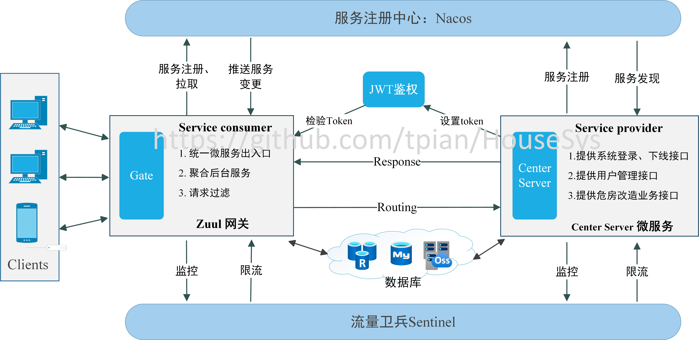
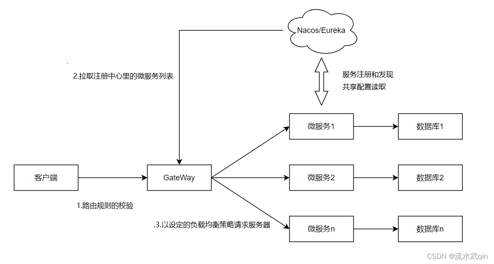

# HouseSys

对个人完成的项目危房改造管理系统的后端介绍说明，项目已商用，本仓库仅做介绍与**后端框架**学习用途，项目代码不开源
线上商用地址：https://weifangguanli.com
Web 管理系统主页截图：

小程序主页截图：


## 系统架构


系统中主要包括 MySQL、Redis、后端服务器、Web 管理系统、微信小程序五个部分。

1. Web 管理系统：

   > **登录用户**：村、镇街、局县、民政局、住建局干部；
   > **主要作用**：
   >
   > - 进行系统用户管理，干部注册；
   > - 完成对农户的危房改造申请进行审核审批的功能；
   > - 发布新政策、违规警告；
   > - 系统数据看板；
   > - 完工的危房改造建设项目生成 word 档案，并在线打印

2. 微信小程序

   > **登录用户**：申请危房改造的农户；村、镇街、局县、民政局、住建局干部；
   > **主要作用**：
   >
   > - 农户登录
   >   - 农户注册；
   >   - 提出危房改造申请；
   >   - 改造申请通过后，建房过程中，提交房屋图片、建房件货、责任书等材料。
   > - 干部登录
   >   - 审核/驳回申请

3. 后端服务器：

   > - 连接数据库，实现数据管理
   > - 与客户端（web、小程序）进行网络通信，提供服务 api

4. MySQL 数据库：

   > - 存储主要的业务数据，如乡镇选项、系统用户、用户权限、申请记录、建设记录等。

5. Redis 缓存：
   > - 缓存验证码、用户权限、token、在线状态等有过期时间数据或热点数据。

## 技术栈

- Java
- Sping Boot: 简化 Spring 应用的创建、运行、调试、部署;
- Spring Cloud: 基于 Spring Boot 的开发便利性，简化了分布式系统基础设施的开发，构建了服务治理(发现注册)、配置中心、消息总线、负载均衡、断路器、数据监控、分布式会话和集群状态管理等功能;
- Mybatis: 内部封装了 JDBC，简化了加载驱动、创建连接、创建 statement 等繁杂的过程，开发者只需要关注 SQL 语句本身;
- Nacos: Spring Cloud 中的注册中心,发现、配置和管理微服务；
- Sentinel： 流量卫兵，发挥数据监控与限流作用。

## 后端环境

```
JDK 1.8
MySQL 5.7.36
Redis
Maven
IDEA编译器，IDE插件，lombok插件
```

## 后端架构

本项目后端主要采用了在 Spring Cloud 微服务架构，能支持多业务系统并行运行。在本项目的中运行的业务系统主要为危房改造业务系统，除此业务外，本系统还能支持其他业务。


### 架构组件

微服务中包含三个基本组件：注册中心、服务提供者、服务消费者。当服务消费者 A 需要调用服务提供者 B 的接口时，由注册中心向 A 提供 B 的地址与端口进行调用。

**1. Service Consumer（Gateway）**

项目中使用的服务消费者同时是本系统的网关 gateway，网关服务的 application.yml 相关配置如下：

```xml
spring:
  application:
      name: gateway-name  #自己设置服务名
  cloud:
    nacos:  # 注册中心
      discovery:
        server-addr: xxx.xxx.xxx.xxx:xxxx  # 需要根据实际配置nacos IP与端口号
    gateway:
      default-filters: # 默认过滤器配置(全局过滤器)
         - DedupeResponseHeader=Access-Control-Allow-Origin  # 允许跨域请求
      globalcors: #跨域配置
         add-to-simple-url-handler-mapping: true
         corsConfigurations:
           '[/**]':
             allowed-origins: "https://weifangguanli.com" #  运行跨域请求的网站
             allowed-methods: "*"  # 允许跨域的请求方式：所有
             allowed-headers: "*"  # 允许跨域请求携带的头信息头信息：所有
             allow-credentials: true  # 允许携带cookie
      discovery:
        locator:
          lowerCaseServiceId: true  # 请求路径上的服务名配置为小写
          enabled: true  # 通过注册中心创建路由
      routes:  # 自定义转发路径
        - id: ace-auth  # 目标服务ID
          uri: lb://ace-admin  # 在nacos中注册的目标服务URI
          order: 8000  #
          predicates: #断言，与下面条件相匹配的请求进行路由
          - RequestBody=true  #需要请求头
          - Path=/api/auth/**  #路径匹配
          filters:
          - StripPrefix=2  # 改写HTTP请求，转发时去掉前2个前缀
        - id: ace-admin
          uri: lb://ace-admin #注意和上一个服务是同一个URI，本质在同一个URI中
          order: 8001
          predicates:
          - RequestBody=true
          - Path=/api/admin/**
          filters:
          - StripPrefix=2

         # 下面两个URI非本危房管理系统中用到的URI，不做介绍
        - id: ace-generator
          uri: lb://ace-generator
          order: 8001
          predicates:
            - Path=/api/code/**
          filters:
            - StripPrefix=1
        - id: ace-sample
          uri: lb://ace-sample
          order: 8001
          predicates:
            - RequestBody=true
            - Path=/api/sample/**
          filters:
            - StripPrefix=2
```

在本系统中，微服务只接受来自网关的请求，而客户端与服务器通信的唯一入口是 gateway，能保障后台服务的安全性，并动态地将请求路由到不同的后端集群中。除路由转发到微服务外，还使用了一些其他技术实现实际应用过程中的用户体验感的提升。gateway 在网络中的示意图如下：


- 路由转发

  例如，如通过前面的配置，发送到网关的请求`/api/auth/captcha`，由于符合转发路径中的第一个路由，请求将转发到将路由到 lb://ace-admin，具体 IP、port 由**注册中心**提供，请求地址也将从`/api/auth/captcha`变成`/captcha`。

- 请求拦截

  在前面的配置中，已通过`default-filters`进行了全局过滤器，此外转发路径`routes`中,通过断言`predicates`、当前路由过滤器`filters`进行对具体某个路由的过滤与转换，已能满足大多数需要。但在危房改造系统中，需要确保通过鉴权的客户端才能与服务器通信，因此实现了 GlobalFilter 接口，对请求进行鉴权拦截。
  

  ```Java
  @Configuration
  public class AccessGatewayFilter implements GlobalFilter {
     @Value("${gate.ignore.startWith}")
     private String startWith; # 通过application.yml配置忽略token校验的接口地址，如获取验证码、获取token接口
     @Autowired
     private StringRedisTemplate stringRedisTemplate; # token保存在redis中，存在过期时间

     // ...其他成员属性

     @Override
     public Mono<Void> filter(ServerWebExchange serverWebExchange, GatewayFilterChain gatewayFilterChain) {
        /**
           通过gatewayFilterChain.filter(exchange)编写前置滤器逻辑，在请求被路由之前调用，设计中仅用到前置过滤器
           通过gatewayFilterChain.filter(exchange).then(Mono.fromRunnable(() -> {过滤器逻辑})编写后置滤器逻辑，在路由到微服务之后调用
           1.校验token是否过期、是否合法，从token获取用户信息校验用户是否具有接口权限
           2.检验用户权限时需要请求微服务中的对应接口
           3.接口地址开头为startWith的接口不需要校验token与权限
        */
     }

     // ...其他成员方法
  }
  ```

  全局过滤器 AccessGatewayFilter 实现了 GlobalFilter 接口，在所有路径上均能进行拦截处理。同时使用了@Configuration 注解使 IOC 容器能扫描注册该全局过滤器。
  在请求拦截中，对 token 的鉴别主要使用 JWT 鉴权，这部分的内容将在业务模块的介绍中具体展开。

- 负载均衡

  当使用微服务集群时，负载均衡会将将流量分发到不同的后端服务来扩展应用系统的服务吞吐能力，消除单点故障并提升应用系统的可用性。在危房改造系统中，通过使用`Spring Cloud Loadbalancer`依赖实现负载均衡，由于 Spring Cloud 默认均衡器为 Ribbon，需要在配置项中将其禁用：

  ```xml
   spring:
      application:
         name: ace-gateway
      cloud:
         loadbalancer:
            ribbon:
            enabled: false
  ```

  同时，配置 restTemplate 对象注入方法，@LoadBalanced 注解表示调用远程服务地址时会使用负载均衡器。

  ```java
  @Configuration
   public class GatewayConfig {

      @LoadBalanced
      @Bean
      public RestTemplate restTemplate() {
         return new RestTemplate();
      }
      // ...其他配置
   }
  ```

* 服务熔断

  ```xml
  hystrix:
     threadpool:
        default:
           coreSize: 1000 ##并发执行的最大线程数，默认10
           maxQueueSize: 1000 ##BlockingQueue的最大队列数
           queueSizeRejectionThreshold: 500 ##即使maxQueueSize没有达到，达到queueSizeRejectionThreshold该值后，请求也会被拒绝
     command:
        default:
           execution:
           isolation:
              thread:
                 timeoutInMilliseconds: 10000
  ```

## 业务模块

### 用户管理

### 申报审批管理

### 政策宣传

# 最近笔试、面试、论文方面的准备较为繁忙，将后端代码抹去关键信息开源，后期将不定期更行，预计 10.1 前更新完成。
